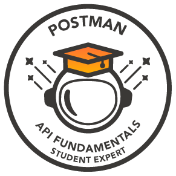

<h1 align="center">Hi 👋, I'm <a href="https://www.linkedin.com/in/appaji-dheeraj/">Appaji Nagaraja Dheeraj</h1>
<h3 align="center">I'm a passionate <Tech_Enthusiast> diving into new technologies,imporoving my logical and analytical thinking and problem solving skills.</h3>

  <!--- Adding Header Elements -->

  <a href="https://dheerajnagaraja.wixsite.com/portfolio">Portfolio</a> -
  <a href="https://www.linkedin.com/in/appaji-dheeraj/">LinkedIn</a> - 
  <a href="https://x.com/appaji_dhe22452">Twitter</a> -
  <a href="https://x.com/sanjay_kv_">Instagram</a> -
  <a href="">Google Featured</a> -
  <a href="">Contact me.</a> 

-----------------------------------------------------------
👨🏻‍💻 **About Me** 
✨ Tech Enthusiast |  
⚡ Check my ✨ [Website](https://dheerajtech-portfolio.netlify.app/)  
📫 How to reach me **dheeraj.nagaraja@gmail.com**  

<h3 align="left">Languages and Tools:</h3>

          

  
<h3>Certifications</h3>

  Certification Badges 🪶

<a href="https://api.badgr.io/public/assertions/JhAzk13bSl6r_MMoF8kw1Q?identity__email=dheeraj.nagaraja%40gmail.com">

 

  

  

<h3 align="left">Connect with me:</h3>

 

  
	
    
<b>📚 Recent Projects/ Activity</b>
 
  ✨  
  ✨  

 

## GSSOC(24) Badges 🪶

-----------------------------------------------------------

   
<b> Show some ❤️ by starring some of the repositories!.
 

